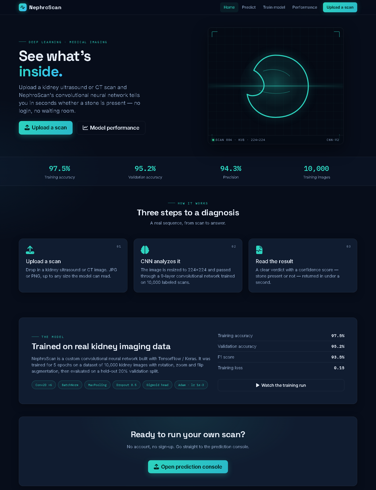
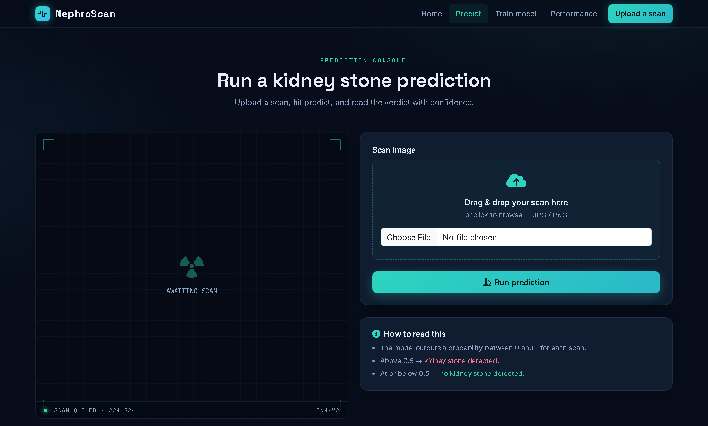
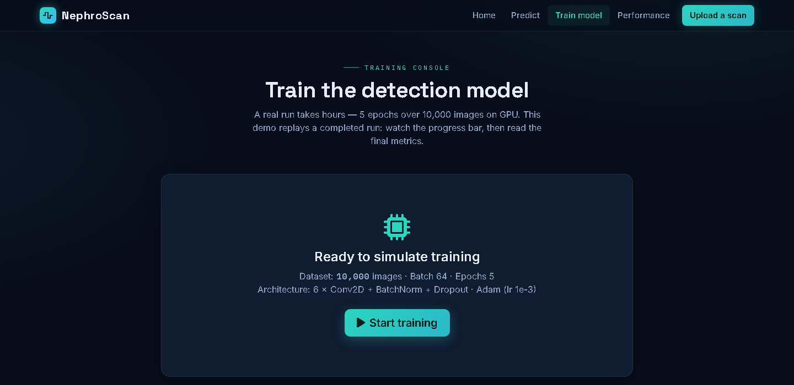
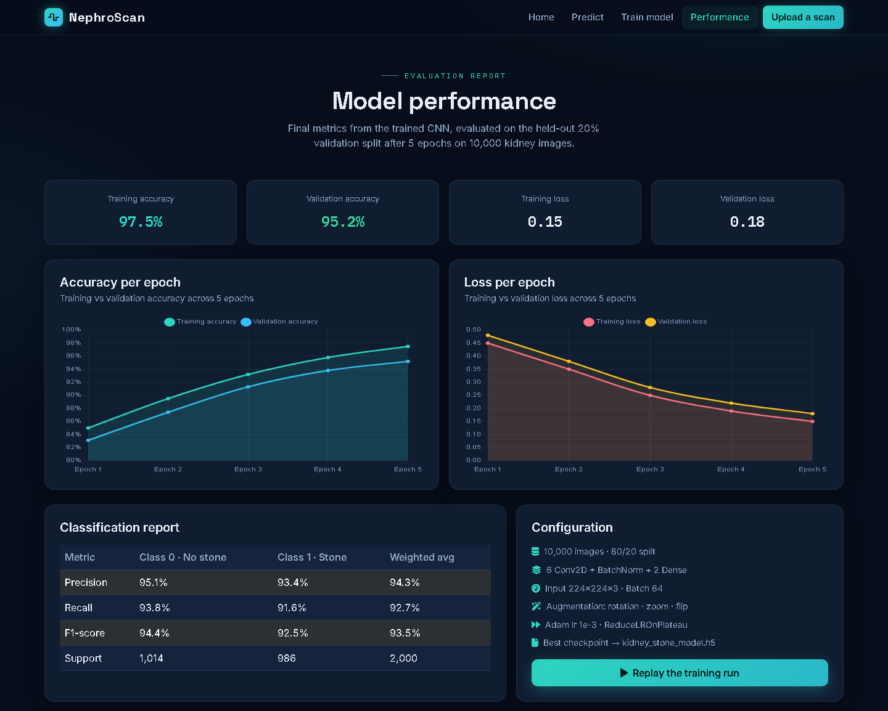

# NephroScan — Kidney Stone Detection with CNN

An academic deep-learning project that detects kidney stones in medical imaging.
Upload a kidney ultrasound/CT scan and a convolutional neural network (TensorFlow/Keras)
returns a verdict with a confidence score — no login required.

Live demo deployed on Render: `https://kidney-stone-detection-l1n2.onrender.com`

## Features

- **Prediction console** — upload a scan (drag & drop or browse), see it analyzed in a
  scan viewport, and read the result with a confidence bar.
- **Simulated training console** — real training takes hours (5 epochs on ~10,000
  images), so the demo replays a completed run: a progress bar with epoch-by-epoch log
  completes in ~8 seconds and returns the final metrics without training anything.
- **Model performance report** — accuracy/loss curves per epoch, classification report
  (precision, recall, F1), and the full training configuration.
- **No authentication** — the site is fully public; user/admin login and registration
  were removed.

## Screenshots

| Home | Prediction console |
| :---: | :---: |
|  |  |

| Training console | Model performance |
| :---: | :---: |
|  |  |

## Stack

- Django 5 + SQLite (`dj-database-url` for Postgres on Render)
- TensorFlow / Keras CNN — 6 Conv2D blocks + BatchNorm + Dropout, input 224×224×3,
  trained for 5 epochs on 10,000 kidney images (20% validation split)
- Bootstrap 5 + Chart.js, dark "radiology suite" UI
- Gunicorn + WhiteNoise for production

The model (`kidney_stone_model.h5`) is committed and loaded lazily on the first
prediction so the app boots quickly and does not hold TensorFlow in memory at startup.

## Run locally

```bash
python -m venv .venv
# Windows: .venv\Scripts\activate   |   macOS/Linux: source .venv/bin/activate
pip install -r requirements.txt
python manage.py migrate
python manage.py runserver
```

Open http://127.0.0.1:8000

## Deploy to Render

1. Push this repository to GitHub/GitLab.
2. In Render, create a **Web Service** pointing at the repo.
3. Build command: `./build.sh` (installs deps, collects static files, migrates).
4. Start command: `gunicorn KSD.wsgi:application`
5. Runtime is pinned to Python 3.12 in `runtime.txt`. Set `DEBUG=false` via the
   `DEBUG` environment variable; the service host is already in `ALLOWED_HOSTS`.

> Note: Render's free tier has ~512 MB RAM. The TensorFlow import happens only when a
> prediction is first made (lazy loading), so the site itself stays light.

## Project structure

```
KSD/        Django project (settings, urls)
Users/      App: prediction, simulated training, model performance views
templates/  base.html + home / prediction / training / model_performance
static/     Static assets
kidney_stone_model.h5   Trained CNN (134 MB)
```

## Academic notes

This is a demonstration project for a portfolio. The prediction endpoint runs a real
pre-trained model; the training page is intentionally simulated to keep the demo
interactive. In a full research setup you would train on a GPU for several hours and
report the validation metrics shown on the Performance page.
